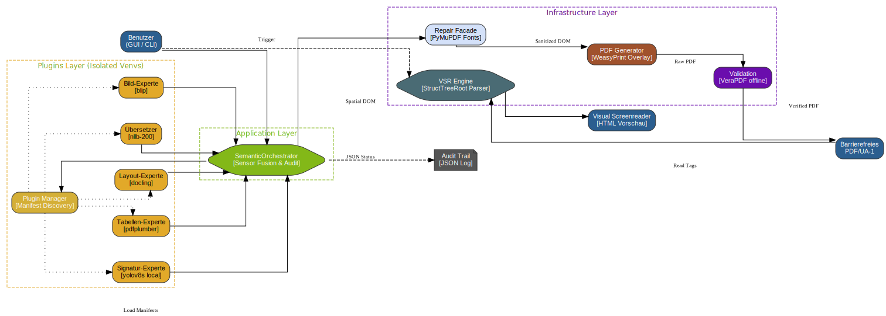

# 🛠️ PDF A11y Converter

[](https://pylint.pycqa.org/)
[](https://pdfa.org/)
[](https://www.gnu.org/licenses/gpl-3.0)

**Eine autarke, KI-gestützte Lösung zur PDF/UA-1 Rekonstruktion.**  
*Strikte Architektur. Absolute Datenhoheit. Integrierte Endabnahme.*

---

## 📥 Download (Standalone Versionen)

Für Windows und macOS stellen wir komplett vorkompilierte, 100% offline-fähige Pakete zur Verfügung. Da die integrierten KI-Modelle (PyTorch, YOLO, NLLB, etc.) für den lokalen Betrieb sehr groß sind, hosten wir die Pakete (ca. 3,5 GB) auf einem dedizierten High-Speed Cloud-Speicher der TU Dortmund.

> 🔒 **Download-Passwort:** Aus Sicherheitsgründen erfordert der Universitäts-Server ein Passwort für den Download. Bitte nutze: **yBmqxDneq2**

### 🪟 Windows 11
- [⬇️ Download PDF-A11y-Converter (Windows) .zip](https://tu-dortmund.sciebo.de/s/ijbi8cCZgHazMtr)
- **SHA256:** `7a15f547b61f46cf8646540aa3e208e32c914b953f81cdd248cc642134c85905`

### 🍎 macOS (Apple Silicon & Intel)
- [⬇️ Download PDF-A11y-Converter (macOS) .zip](https://tu-dortmund.sciebo.de/s/GqCmHs7PK9pwKFr)
- **SHA256:** `b071f98561597bdd90348a9c44774f717b7a01329f0428cab7e2b2d80bea0b4d`

<details>
<summary><b>🍏 Besonderer Hinweis für macOS-Nutzer (Apple Gatekeeper)</b></summary>

Da dieses Tool ein echtes, lokales Open-Source-Projekt ist, verzichten wir auf kostenpflichtige Apple-Entwicklerzertifikate. macOS markiert heruntergeladene Programme aus dem Internet standardmäßig mit einem Quarantäne-Flag. Beim ersten Start erscheint daher möglicherweise die Meldung: *"Kann nicht geöffnet werden, da der Entwickler nicht verifiziert werden kann."*

**Lösung 1 (Der Apple-Weg):**
1. Mache einen **Rechtsklick** (oder Control-Klick) auf die App `PDF-A11y-GUI`.
2. Klicke im Kontextmenü auf **"Öffnen"**.
3. Bestätige den folgenden Sicherheitsdialog mit **"Trotzdem öffnen"**.
*(Dies muss nur ein einziges Mal gemacht werden).*

**Lösung 2 (Für Profis via Terminal):**
Entferne das Apple-Quarantäne-Flag manuell mit einem Befehl:
`xattr -cr /Pfad/zum/entpackten/Ordner/PDF-A11y-GUI.app`
Danach startet das Programm per normalem Doppelklick.
</details>

---

## 🎯 Die Vision: Das "Semantic Overlay" Prinzip

Die nachträgliche Barrierefrei-Machung von PDFs (Remediation) scheitert meist an einem massiven Dilemma: Baut man das PDF neu auf, zerstört man das exakte visuelle Layout (Corporate Design). Nutzt man Cloud-Tools, verliert man die Datenhoheit und verletzt Datenschutzrichtlinien.

Der **PDF A11y Converter** löst dieses Problem radikal durch das **Semantic Overlay Pattern**:
1. **Visuelle Treue (100% Visual Fidelity):** Das optische Erscheinungsbild des Original-PDFs bleibt auf den Pixel genau erhalten.
2. **Semantische Tiefe:** Das Tool generiert einen komplett unsichtbaren, perfekten PDF/UA-1 Strukturbaum (`WeasyPrint`) und legt das visuelle Original als für Screenreader unsichtbares Grafikelement (`/Artifact`) via `pikepdf` in den Hintergrund.

*Das Resultat:* Das Ausgangsprodukt sieht exakt so aus wie das Eingangsprodukt, ist aber maschinenlesbar, semantisch fehlerfrei und PDF/UA-1 konform.

## 🧠 Architektur: Multi-Agenten-System

Dieses Projekt ist als **Multi-Agenten-System** konzipiert. Um die gefürchtete *Dependency Hell* moderner KI-Bibliotheken zu vermeiden, läuft jeder Spezialist (Worker) in seiner eigenen, isolierten virtuellen Umgebung (Venv). Die Kommunikation erfolgt asynchron über ein Blackboard (Spatial DOM).



## ✨ Kern-Features

- **100% On-Premise:** Keine Cloud, keine APIs. Alle Daten bleiben lokal.
- **Preflight Diagnostics:** Automatische Erkennung von korrupten Text-Layern (z.B. Type-3 Fonts oder fehlendes Font-Embedding). Das System schaltet vollautomatisch auf eine visuelle OCR-Rekonstruktion (Flattening) um, um Ghost-Fonts zu vernichten.
- **Fail-Fast & Graceful Degradation:** Fällt ein KI-Worker aus (z.B. OOM-Error), stürzt das System nicht ab, sondern greift auf Fallback-Strategien zurück.
- **Integrierte Endabnahme:** Jedes konvertierte PDF wird lokal durch den offiziellen **veraPDF** Validator maschinell geprüft (Pydantic-Vertrag).

## 🛠️ Die Experten (Worker-Pool)

Das System bündelt die weltweit besten Open-Source-Technologien autonom in eigenen venvs:
- **Layout & Struktur:** `docling` (IBM) und `marker-pdf`
- **Tabellen-Präzision:** `pdfplumber` & `pandas`
- **Wissenschaftliche Formeln:** `nougat-ocr` (Meta)
- **Fußnoten & Zitate:** `grobid` (Machine Learning für Bibliographien)
- **Bild-Beschreibungen (Alt-Texte):** `BLIP` (Salesforce) via HuggingFace
- **Formulare & Vektoren:** `pikepdf`
- **Tag-Generierung (Overlay):** `WeasyPrint`
- **Handschriften & Signaturen:** `YOLOv8s` (Lokales Offline-Modell)
- **i18n Sprach-Übersetzung:** `NLLB-200` (Meta) zur automatischen Übersetzung von KI-Bildbeschreibungen in die Dokumentsprache.

## 👥 Zielgruppe

Dieses Tool richtet sich an:
- **Accessibility Engineers**, die eine skalierbare, datenschutzkonforme Pipeline benötigen.
- **Behörden & Universitäten**, die das Barrierefreiheitsstärkungsgesetz (BFSG) lokal umsetzen müssen.
- **Software-Architekten**, die Best-Practices im Umgang mit isolierten KI-Workern und Sensor-Fusion suchen.

## 🚀 Installation & Nutzung

*Voraussetzung: Python 3.12+, Linux/macOS/Windows.*

```bash
# 1. Repository klonen
git clone https://github.com/harald-er-ihn/pdf-a11y-converter.git
cd pdf-a11y-converter

# 2. Main-Environment einrichten
python3 -m venv venv
source venv/bin/activate
pip install -r requirements-dev.txt

# 3. Experten-Worker initialisieren (Baut die isolierten Venvs)
./tools/rebuild_worker_venvs.sh

# 4. CLI nutzen
python cli.py eingabe.pdf -o ausgabe_pdfua.pdf -v
```

## ☕ Support & Spenden
Dieses Projekt ist zu 100% Open-Source. Es gibt keine Paywalls und keinen versteckten Cloud-Zwang.

Wenn dir dieses Tool die Arbeit erleichtert hat oder du die Weiterentwicklung unterstützen möchtest, freue ich mich über einen Kaffee:


© 2026 Dr. Harald Hutter

