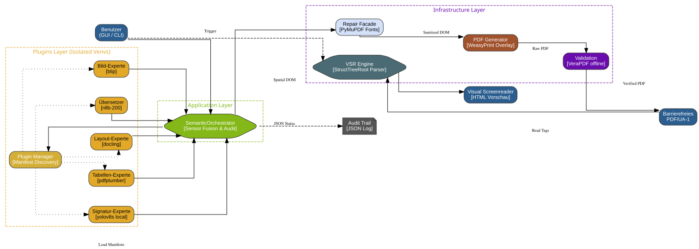

# 🛠️ PDF A11y Converter

**Semantischer Overlay-Compiler zur Rekonstruktion barrierefreier PDFs (PDF/UA).**  
*Strikte Clean Architecture. Absolute Datenhoheit. Integrierte Endabnahme.*

---
> **Projektstatus:** Abgeschlossen / archiviert.  
> Dieses Repository wird derzeit nicht mehr aktiv weiterentwickelt.
---
> **Hinweis zum Entwicklungsstand:**  
> Dieses Repository enthält den eingefrorenen Stand eines nicht abgeschlossenen
> Entwicklungsprojekts in Version `0.1.0`.
>
> Die Software kann unvollständig sein und Fehler enthalten. Es besteht keine
> Gewähr für Funktionsfähigkeit, Aktualität, Kompatibilität oder PDF/UA-Konformität.
> Es sind keine weiteren Korrekturen, Releases oder Supportleistungen vorgesehen.
>
> Der Quellcode wird aus Dokumentations- und Archivierungsgründen bereitgestellt.---
---

## 🎯 Die Vision: Das "Semantic Overlay" Prinzip

Die nachträgliche Barrierefrei-Machung von PDFs scheitert meist an einem massiven Dilemma: 
Baut man das PDF neu auf (Reflow), zerstört man das exakte visuelle Layout (Corporate Design, Metriken). Nutzt man Cloud-Tools, verliert man die Datenhoheit.

Der **PDF A11y Converter** fungiert daher nicht als klassischer Konverter, sondern als **Semantic Overlay Compiler**:
1. **100% Visual Fidelity:** Das optische Erscheinungsbild des Original-PDFs bleibt auf den Pixel genau erhalten.
2. **Semantische Tiefe:** Das Tool generiert einen komplett unsichtbaren, perfekten PDF/UA-1 Strukturbaum und stempelt das visuelle Original als Grafik in den Hintergrund.

## ⚠️ Systemgrenzen (Bitte beachten)

Unser System konzentriert sich exklusiv auf die Rekonstruktion von klassischen PDF- und Fotodokumenten (Text, Layouts, Tabellen, Bilder).

🚫 **Interaktive Formulare:**  
Mit unserem architektonischen "Semantic Overlay"-Ansatz können wir **keine** interaktiven Formulare (AcroForms) verarbeiten oder neu erzeugen. Das System stempelt das Originaldokument als flache Vektorgrafik in den Hintergrund. Interaktive Felder würden dabei ihre Ausfüllbarkeit verlieren. Das System **bricht daher automatisch ab**, wenn es ein interaktives Formular erkennt.

⚠️ **Mathematische Formeln:**  
Das System ist in der Lage, mathematische Formeln via KI zu erkennen und als MathML in das Dokument einzubetten. Bitte beachten Sie jedoch: Der PDF/UA-Standard für MathML wird von aktuellen Screenreadern (wie JAWS oder NVDA) noch **sehr inkonsistent** unterstützt. Das erzeugte PDF ist technisch konform, das Vorlese-Ergebnis kann je nach Endgerät des Nutzers jedoch variieren!

## 🧠 Architektur: Clean Architecture & Layout Graph Model

Das System ist in strikt getrennte Schichten unterteilt. 
Die Kerninnovation ist der Einsatz eines **Topological Layout Graph Models**. Anstatt Bounding Boxes naiv und zerstörerisch zu überlagern, modelliert das System das Dokument als Graphen. Text-Aware Bipartite Matching, Spatial Constraint Solving und XY-Cut Sortierung garantieren eine perfekte Lesereihenfolge (Reading Order) ohne Datenverlust durch OCR-Drifts.

## ✨ Enterprise Kern-Features

- **100% Native & Offline:** Keine Server, kein Docker, keine Cloud. Alle KI-Frameworks werden durch harte Environment-Blocker an der Telemetrie gehindert (DSGVO & BSI konform).
- **Topologische Graphen-Fusion:** Komplexe Layouts (Spalten, Footnotes, Captions) werden über Kanten verknüpft und erhalten die PDF/UA-Lesereihenfolge aufrecht.
- **Fail-Fast Coordinate Layer:** Automatisierte Normierung diverser KI-Koordinatensysteme (Docling, PDF, YOLO-Pixel).
- **Graceful Degradation:** Stürzt eine KI ab (z.B. VRAM Out-of-Memory), fängt das System den Fehler via JSON-Contract ab.
- **Maschinenlesbarer Audit-Trail:** Laufzeiten, Worker-Ergebnisse und die integrierte Endabnahme (veraPDF) werden revisionssicher protokolliert.

## 🛠️ Die KI-Experten (Worker-Pool)

Aktuell laufen **11 spezialisierte Worker** in isolierten Venvs:
- **Layout:** `docling` & `marker-pdf`
- **Tabellen:** `pdfplumber` (inkl. Whitespace-Grid Detection)
- **Formeln:** `nougat-ocr` (Meta)
- **Vision & Übersetzung:** `BLIP` & `NLLB-200`
- **Heuristiken:** Columns, Footnotes, Header/Footer (PyMuPDF)

## 👥 Zielgruppe

Dieses Tool richtet sich an **Accessibility Engineers**, **Behörden** und **Universitäten**, die das Barrierefreiheitsstärkungsgesetz (BFSG) lokal, datenschutzkonform und skalierbar umsetzen müssen.

## ☕ Support & Spenden
Dieses Projekt ist zu 100% Open-Source. Es gibt keine Paywalls und keinen versteckten Cloud-Zwang.
Wenn dir dieses Tool die Arbeit erleichtert hat, freue ich mich über einen Kaffee:

© 2026 Dr. Harald Hutter

## Projektende

Die Entwicklung dieses Projekts wurde mit Version `0.1.0` dauerhaft beendet.
Beiträge, Pull Requests und Feature-Anfragen werden nicht mehr bearbeitet.
